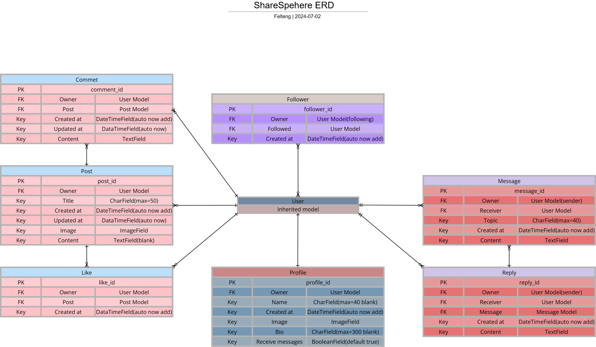
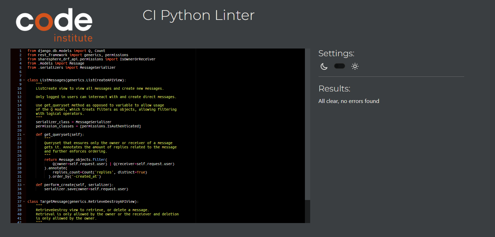

# ShareSphere DRF API

This is a private facing backend/API for the ShareSphere application, which currently only features a web based application in a [separate repository](https://github.com/Felteng/sharesphere-web). This API serves as the backbone for the ShareSphere platform and enables user to user media sharing, content interaction, user interaction, and user management. This API is built as part of my 5th milestone project for Code Institutes full stack development course, it is built using modern technologies and adhering to best practices to the best of my abilities. The API aims to ensure a secure, efficient, reliable, and responsive communication between the client and the server.

[Live link](https://sharesphere-web-9f70d26dc82a.herokuapp.com/) to web based frontend for this API.

## Agile Development

The entirety of this project has been built utilizing the agile development approach. The agile approach, combined with GitHub projects, has served as a tool that has helped visualize, plan, and execute different phases of the project development. The [GitHub project](https://github.com/users/Felteng/projects/4) created for this project features a kanban board where the various issues and their status can be seen. This backend application's repository as well as the frontend web repository share the same project board to ensure a seamless integration of development between the two.

To view the user stories set out for this project please refer to the project link in the above paragraph. By clicking on any user story on the board a detailed view containing the user story and its acceptance criteria will be made visible. All the issues on the kanban board have received different labels to convey things like relevancy and importance. Frontend and backend related issues have their own separate labels and issues may be filtered as such.

## Database Design

### Database Model

The entity relationship diagram for the initial database model was made using [Cacoo's](https://cacoo.com) diagram tool.



### Custom Models

- The profile model has received the added boolean field and function of "receive_messages", this is to give the user control of whether or not they want to receive messages from other users.

- The message model works as an individual conversation between 2 users which can have multiple replies linked to it. This means that the same 2 users can have multiple different conversations/direct messages active regarding different topics.

- Any number of replies may be made in relation to a conversation for the users to engage in continous discussion about the topic.

### CRUD

The principles of CRUD are at the essence of this project's features and any future features.

**Create:**
An authenticated user can create posts, like posts, follow other users, create post comments, and send direct messages to other users that have receive messages enabled.

**Read:**
A user can browse and read any posts made on the website and see thei respective amount of comments and likes, posts can also be sorted by ones the user has liked or from users they follow. Comments made under any post can be read by any user. If the user is engaged in any conversation with another user the contents of that conversation may also be read at any time. The amount of followers and or the amount of users a user follows can be seen from each indiviual users profile page.

**Update:**
An authenticated user can edit and update their profile as well as their individual contributuions to the site, bar conversations and their replies.

- The reason a conversation or reply cannot be edited is to avoid any malicious altering of a private conversation between 2 indivuals to make it seem as though a user had different intents in relation previous messages. They may still be deleted to ensure controlled privacy.
  - This could be worked around as a future feature where any updates made would save history of the previous versions of an object.

**Delete:**
An authenticated user can delete any of their contributions made to the site. Unfollowing, unliking, removing a post and all its comments, removing an individual comment, removing a conversation and all its replies, removing an individual reply..

## Technologies Used

### Environments

- [Cacoo](https://cacoo.com/) (ERD creation)
- [GitHub](https://github.com/) (Version control / Agile board)
- [GitPod](https://gitpod.io/) (IDE)
- [Heroku](https://heroku.com/) (Site hosting)

### Python Libraries and Packages

- [pillow](https://pypi.org/project/pillow/) (Adds extensive image proccessing capabilities)

- [psycopg2](https://pypi.org/project/psycopg2/) (Adapter for PostgreSQL databases)

- [gunicorn](https://pypi.org/project/gunicorn/) (WSGI HTTP web server to power run the API)

### Django Packages

- [Django REST framework](https://www.django-rest-framework.org/) (Toolkit for building web APIs)

- [django-allauth](https://django-allauth.readthedocs.io/en/latest/) (User authentication)

- [django-cors-headers](https://pypi.org/project/django-cors-headers/) (App that adds CORS headers to responses)

- [djangorestframework-simplejwt](https://pypi.org/project/djangorestframework-simplejwt/) (JSON web token authentication plugin for Django REST framework)

- [django-filter](https://pypi.org/project/django-filter/) (Adds dynamic QuerySet filtering from URL parameters)

- [dj-database-url](https://pypi.org/project/dj-database-url/) (Allows utilization of the DATABASE_URL environment variable)

### External Libraries and Packages

- [Cloudinary](https://cloudinary.com/) (Hosting and efficient serving of static media files)

### Database

- [CI Database Maker](https://dbs.ci-dbs.net/) (PostgreSQL database hosting provided by Code Institute)

## Testing

### Test Guide

Refer to [TESTING.md](TESTING.md) for the manual and automatic tests that have been carried out.

### Validator Testing

#### Python [CI Python Linter](https://pep8ci.herokuapp.com/)

Any .py file where custom code has been written or added has been checked using Code Institutes pep8 linter.

This is a result from a file with no errors, any file marked with "No errors found." will have had the same result: \


Results collapsed into each app:

<details>
<summary>
    Comments
</summary>

- **comments/admin.py**

  - No errors found.

- **comments/models.py**

  - No errors found.

- **comments/serializers.py**

  - No errors found.

- **comments/urls.py**

  - No errors found.

- **comments/views.py**

  - No errors found.
  </details>

<details>
<summary>
    Direct Messages
</summary>

- **direct_messages/admin.py**

  - No errors found.

- **direct_messages/models.py**

  - No errors found.

- **direct_messages/serializers.py**

  - No errors found.

- **direct_messages/urls.py**

  - No errors found.

- **direct_messages/views.py**

  - No errors found.
  </details>

<details>
<summary>
    Followers
</summary>

- **followers/admin.py**

  - No errors found.

- **followers/models.py**

  - No errors found.

- **followers/serializers.py**

  - No errors found.

- **followers/urls.py**

  - No errors found.

- **followers/views.py**

  - No errors found.
  </details>

<details>
<summary>
    Likes
</summary>

- **likes/admin.py**

  - No errors found.

- **likes/models.py**

  - No errors found.

- **likes/serializers.py**

  - No errors found.

- **likes/urls.py**

  - No errors found.

- **likes/views.py**

  - No errors found.
  </details>

<details>
<summary>
    Posts
</summary>

- **posts/admin.py**

  - No errors found.

- **posts/models.py**

  - No errors found.

- **posts/serializers.py**

  - No errors found.

- **posts/urls.py**

  - No errors found.

- **posts/views.py**

  - No errors found.
  </details>

<details>
<summary>
    Profiles
</summary>

- **profiles/admin.py**

  - No errors found.

- **profiles/models.py**

  - No errors found.

- **profiles/serializers.py**

  - No errors found.

- **profiles/urls.py**

  - No errors found.

- **profiles/views.py**

  - No errors found.
  </details>

<details>
<summary>
    Replies
</summary>

- **replies/admin.py**

  - No errors found.

- **replies/models.py**

  - No errors found.

- **replies/serializers.py**

  - No errors found.

- **replies/urls.py**

  - No errors found.

- **replies/views.py**

  - No errors found.
  </details>

<details>
<summary>
    ShareSphere DRF API
</summary>

- **sharesphere_drf_api/permissions.py**

  - No errors found.

- **sharesphere_drf_api/serializers.py**

  - No errors found.

- **sharesphere_drf_api/settings.py**

  - No errors found.

- **sharesphere_drf_api/urls.py**

  - No errors found.

- **sharesphere_drf_api/views.py**

  - No errors found.
  </details>

### Addressed Bugs

- Messages/conversations are not listed by -created_at order despite the Meta ordering option.

  - The solution to this was to reinforce the ordering in the ListMessages view queryset by adding:

  ```python
  .order_by('-created_at')
  ```

  to the end of:

  ```python
  def get_queryset(self):
        return Message.objects.filter(
            Q(owner=self.request.user) | Q(receiver=self.request.user)
        ).annotate(replies_count=Count('replies', distinct=True))
  ```

  ```python
    def get_queryset(self):
        return Message.objects.filter(
            Q(owner=self.request.user) | Q(receiver=self.request.user)
        ).annotate(
            replies_count=Count('replies', distinct=True)
          ).order_by('-created_at')
  ```

- Making a user sign in request to the /dj-rest-auth/login/ endpoint returns an empty string for the refresh key, as opposed to a string that matches the value of the refresh-token cookie.

  - The string value for the refresh-token is needed on the client side to help the client know whether or not to attempt a token refresh.

  - This is not possible since the string is not returned and the value of the cookie cannot be accessed thanks to the secure HTTP Only protocol.

    - After referring to the dj-rest-auth documentation I learned that if this value is needed on the client side the only way to do so is to disable the HTTP Only protocol:
      ```python
      REST_AUTH = {
      # HTTPYONLY has to be false for refresh_token to be sent to the client
      # as per the dj-rest-auth documentation.
      'USE_JWT': True,
      'JWT_AUTH_HTTPONLY': False,
      ...
      }
      ```

### Unaddressed Bugs

None aware of as of 2024-07-24

## Deployment

### Local Deployment

- Deploying locally is quick and easy as the packages will run and function without any additional effort.

  1. Assuming a Django project present; Open a terminal in the workspace.

  2. To start the local server for development enter the following in the terminal:

     - python3 manage.py runserver

  3. Now the site can be opened through the pop up that appears in the bottom right-hand corner.

### Live Deployment

#### Prerequisites

- Ensure you have the following packages installed by typing `pip freeze > requirements.txt` in an open terminal in your workspace:

  ```javascript
  asgiref==3.8.1
  cloudinary==1.40.0
  dj-database-url==2.2.0
  dj-rest-auth==6.0.0
  Django==5.0.6
  django-allauth==0.63.3
  django-cloudinary-storage==0.3.0
  django-cors-headers==4.4.0
  django-filter==24.2
  djangorestframework==3.15.2
  djangorestframework-simplejwt==5.3.1
  gunicorn==22.0.0
  oauthlib==3.2.2
  pillow==10.4.0
  psycopg2==2.9.9
  PyJWT==2.8.0
  python3-openid==3.2.0
  requests-oauthlib==2.0.0
  sqlparse==0.5.0
  ```

  _Refer to each package' documentation to ensure proper implementation in the project._

  - This is very important for Heroku to know what dependencies are required for the project to function the same way it does in the development environment.

- A PostgreSQL database. The database used for this project was created with Code Institutes database maker, but any database maker will suffice.
  - Follow the relevant instructions to create the database. But this should already be done during early development of your Django project.

#### Instructions

Sign in or create an account at [Heroku](https://heroku.com) and once that's done proceed with the following steps:

1. At the start page/dashboard click 'New' in the top right part of the page to open a small dropdown.

2. In the dropdown select 'Create new app'.

3. Give the application a unique name and choose a region for deployment. I went with Europe since that's the closest for this applications purposes.

4. Click 'Create app'.

5. Back on the dashboard, select the newly created app.

6. On the app page click 'Settings'.

7. We want to set some Config Vars by clicking Reveal Config Vars. These are equivalent to that of the vulnerable variables we have stored in env.py which is ignored by git. Since they are ignored we need to supply them securely to Heroku directly. Make sure the keys match the variables in env.py.

   - Add a key called SECRET_KEY.

     - Set its value to a new secure secret key string or set it to the same one already used in your env.py.

   - Add a key called DATBASE_URL.

     - Set its value to your postgres database URL.

   - Add a key called CLOUDINARY_URL.

     - Set its value to your own cloudinary URL.

   - Add a key called DISABLE_COLLECTSTATIC.

     - Set its value to 1 to ensure the backend doesn't concern itself with any css as its purpose is to serve JSON formatted data.

   Your settings.py should contain CORS headers configuration similar to this:

   ```python
   if 'DEV' not in os.environ:
   CORS_ALLOWED_ORIGINS = [
       os.environ.get('CLIENT_ORIGIN'),
       os.environ.get('CLIENT_ORIGIN_DEV')
   ]
   ```

   - Add a key called CLIENT_ORIGIN.

     - Set its value to the URL of your deployed frontend project without a trailing / \
       example: `https://sharesphere-web-9f70d26dc82a.herokuapp.com`

   - Add a key called CLIENT_ORIGIN_DEV.

     - Set its value to the URL of your local frontend project development server without a trailing / \
       **Beware that this URL may have to be updated if your IDE's workspace gets a new URL**

8. Below Config Vars we need to add the heroku/python buildpack.

Now to prepare the project itself for deployment on Heroku we need to make sure Heroku knows what dependencies to install to run the project and that the project recognizes heroku as a safe host.

9. Make sure there's a file called 'requirements.txt' in the root directory.

10. If you haven't already, type `pip freeze > requirements.txt` in the terminal and you should see package references added to the requirements.txt file.

11. Create a file called Procfile, it should not have any extension. Make sure its content matches this: `web: gunicorn <your_project_name>.wsgi`

12. Add `'.herokuapp.com'` to your ALLOWED_HOSTS list, and `'https://*.herokuapp.com'` to your CSRF_TRUSTED_ORIGINS list in settings.py.

13. Make sure DEBUG is set to False in settings.py for the deployed version.

**Make sure to push these changes to your repository before deploying.**

14. Back on the app page on Heroku select 'Deploy', choose GitHub as deployment method and connect your account.

15. Search up the name of the repository for the app to select it.

16. Deploy manually by choosing a branch to deploy from and click 'Deploy Branch'.

    - I enabled automatic deploys for whenever a push is made to 'main' branch. This is however optional.

## Credits

### Technical

- [Code Institute](https://codeinstitute.net/) for introduction and walkthrough of django and django rest framework

- Adam Lapinski from Code Institute for his [drf-api walkthrough](https://github.com/Code-Institute-Solutions/drf-api/tree/ed54af9450e64d71bc4ecf16af0c35d00829a106) which was referred to on various occassions in this API

- [DRF documentation](https://www.django-rest-framework.org)

- [Django documentation](https://docs.djangoproject.com/en/5.0/)
